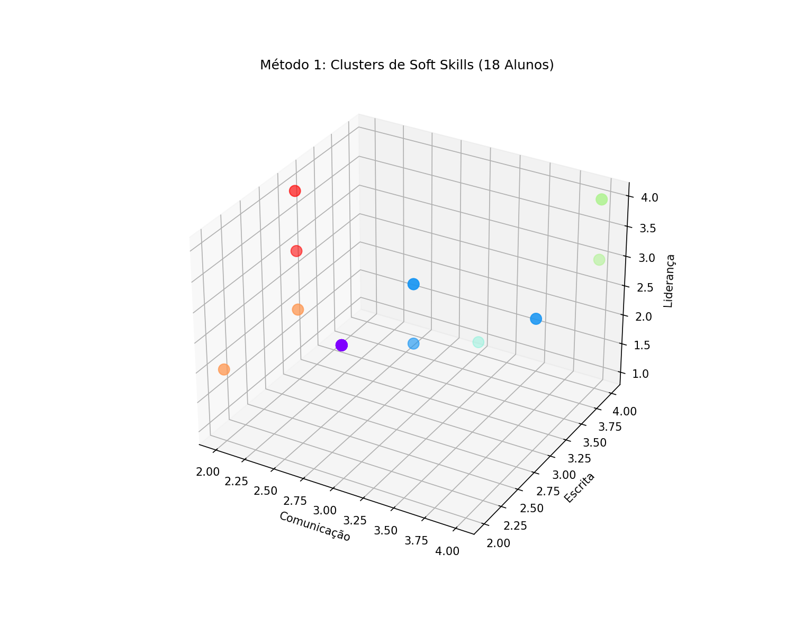
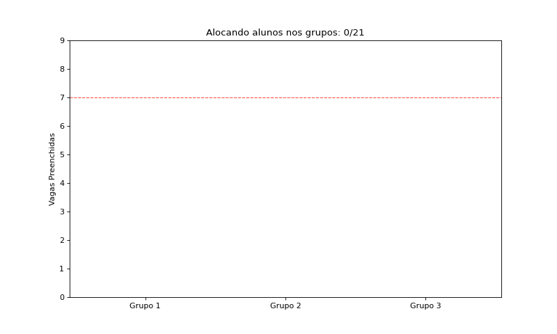
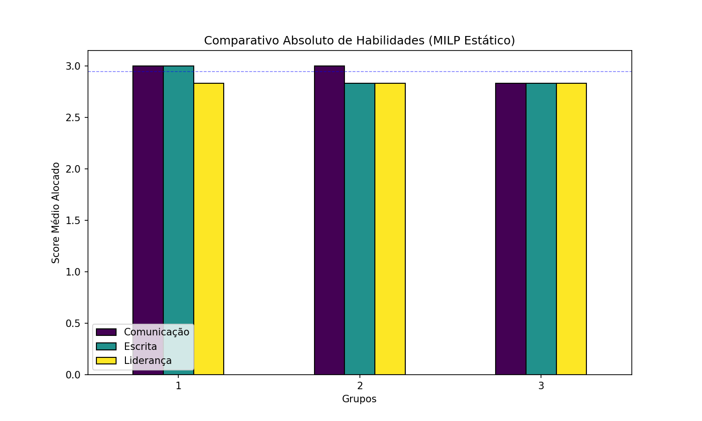
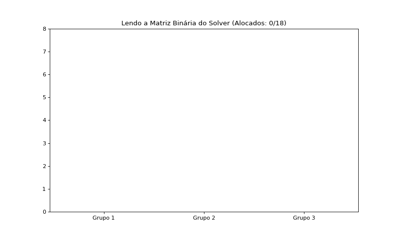
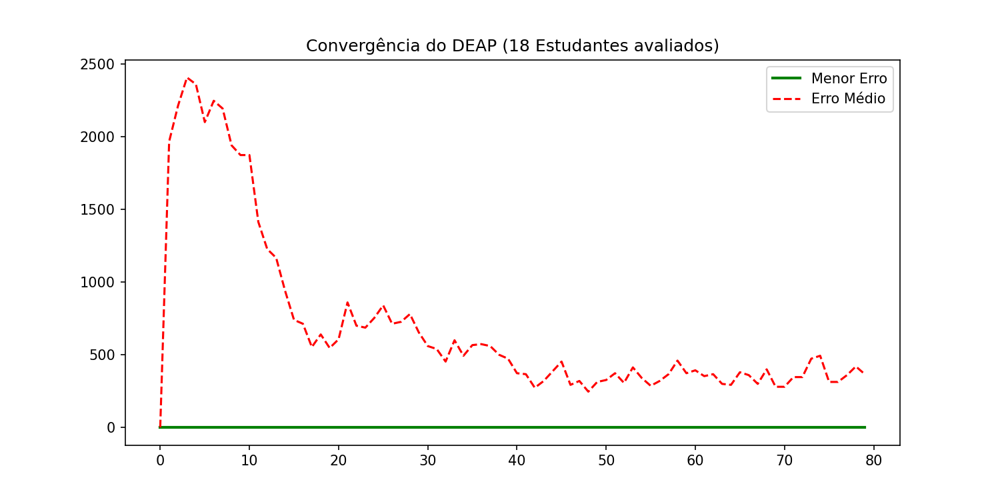
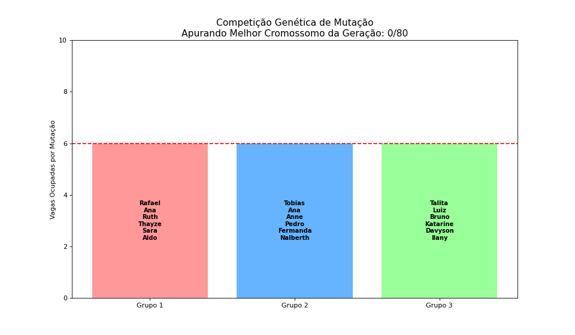
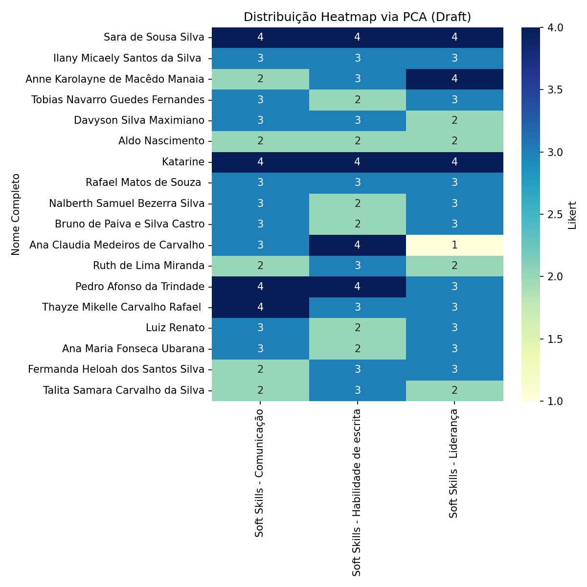
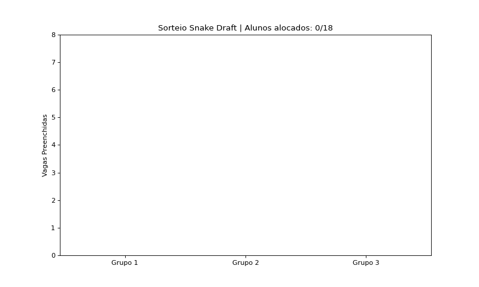

# Resultados dos Métodos Estatísticos de Distribuição de Grupos

Este projeto calcula e avalia quatro rotas estatísticas para distribuir a turma em Grupos de Trabalho super balanceados mediante um questionário de *Soft Skills* (Comunicação, Escrita, Liderança) quantificadas numa escala Likert (1 a 4). 

Para cada método, os 18 alunos avaliados pelo questionário formam a base orgânica. Após a divisão dos algoritmos em 3 grupos exatos de 6 alunos, as âncoras (Yuri, Gilbran, Eduardo) assumem o fechamento para compor os $7$ membros de cada tribo.

---

## 1. Agrupamento Espacial (K-Means Clustering) e Amostragem Estratificada

**Como Funciona:** Rodamos um Algoritmo de Aprendizado Não-Supervisionado K-Means definindo $K=6$. O algoritmo plotou os 18 participantes no espaço tridimensional estático e caçou blocos de 3 alunos muito semelhantes (Nicho Psicológico). 

**Como o Algoritmo Aloca as Pessoas (Dinâmica):** 
A animação GIF demonstra exatamente como sorteamos 1 aluno de cada Nicho por Grupo, garantindo times diversos. Repare que as barras vão sendo preenchidas por um indivíduo diferente de cada vez! Ele puxa uma cor psíquica diferente, até cada grupo lotar as 6 vagas em paralelo!

**Formação das Equipes:**
- **Grupo 1:** Yuri (Âncora), Tobias Navarro, Bruno de Paiva, Thayze Mikelle, Ana Claudia Medeiros, Sara de Sousa, Aldo Nascimento.
- **Grupo 2:** Gilbran (Âncora), Ana Maria Fonseca, Nalberth Samuel, Davyson Silva, Pedro Afonso, Talita Samara, Anne Karolayne.
- **Grupo 3:** Eduardo (Âncora), Luiz Renato, Rafael Matos, Ilany Micaely, Katarine, Ruth de Lima, Fermanda Heloah.

---

## 2. Otimização Combinatória Exata (Programação Linear - MILP)

**Como Funciona:** O Gráfico de Barras Estático prova que houve um empate cravado das três médias de Liderança! Em vez de chutar probabilidades, declaramos uma matriz estrita onde um $Motor\ Simplex$ varreu a modelagem inteira procurando a combinação "perfeita", que trouxesse um menor somatório de "Erros".

**Como o Algoritmo Aloca as Pessoas (Dinâmica):** 
Para alocar pessoas, o motor cria uma matriz binária. Ele atribui "0" se você não foi para o grupo A, e "1" se foi para o grupo B. O GIF Animado acima ilustra como seria se observássemos a leitura sequencial da Matriz Vencedora (aquela que zerou o resíduo estatístico). Pessoas caem instantaneamente na barra a cada $x[i, j] = 1$ verdadeiro!

**Formação das Equipes:**
- **Grupo 1:** Yuri (Âncora), Ana Claudia Medeiros, Luiz Renato, Fermanda Heloah, Sara de Sousa, Ilany Micaely, Nalberth Samuel.
- **Grupo 2:** Gilbran (Âncora), Anne Karolayne, Pedro Afonso, Bruno de Paiva, Thayze Mikelle, Davyson Silva, Aldo Nascimento.
- **Grupo 3:** Eduardo (Âncora), Tobias Navarro, Rafael Matos, Ana Maria Fonseca, Talita Samara, Ruth de Lima, Katarine.

---

## 3. Algoritmos Heurísticos (Otimização Evolutiva Genética DEAP)

**Como Funciona:** Repare no gráfico de linha meste estático... O motor criou populações randômicas cujos Grupos 1, 2 e 3 viviam quebrando a capacidade limite e as somas eram bizarras. Esse sistema copiou comportamento genético da biologia cruzando DNAs de alunos para arranjar combinações de "Fitness" forte onde o Erro Geral atinge zero as 80 gerações matemáticas alcançarem a vida simulada. 

**Como o Algoritmo Aloca as Pessoas (Dinâmica):** 
A Animação GIF ilustra de maneira estupenda o Crossover Estocástico em tempo real a cada Iteração Evolutiva! Note como no começo da vida (Geração 0) a mutação causa grupos aleatórios esburacados como o Grupo 2 batendo Oito ou Nove  pessoas (e ultrapassando a Linha Vermelha de limite ideal), e de repente as Mutações obrigam os alunos a pularem das barras uns para os outros de milissegundo a milissegundo até cravarem nas vagas e encontrarem a combinação pacífica de escores!

**Formação das Equipes:**
- **Grupo 1:** Yuri (Âncora), Rafael Matos, Talita Samara, Thayze Mikelle, Katarine, Ilany Micaely, Aldo Nascimento.
- **Grupo 2:** Gilbran (Âncora), Ana Claudia Medeiros, Luiz Renato, Bruno de Paiva, Fermanda Heloah, Sara de Sousa, Nalberth Samuel.
- **Grupo 3:** Eduardo (Âncora), Tobias Navarro, Ana Maria Fonseca, Anne Karolayne, Pedro Afonso, Ruth de Lima, Davyson Silva.

---

## 4. Redução de Dimensionalidade e Sorteio *Snake Draft*

**Como Funciona e Aloca as Pessoas (Dinâmica):** 
O Algoritmo rotacionou os eixos das *Soft Skills* dos 18 alunos usando o (PCA), compactando tudo numa Escala 1D. Como aloca as pessoas? O GIF Draft ilustra: O 1º colocado no PCA é o primeiro a cair no balde de Seleção da Equipe G1. O segundo sorteado cai no G2... E repare bem no Zigue-Zague visual: A quarta vaga não vai pro G1; ela volta para as mãos do G3 e depois pro G2 para manter o equilíbrio! E a matriz de Heatmap de Cores acima desenha com precisão a densificação dos perfis! Devido à redução, notamos muita mescla nos grupos do centro do bloco. A correlação produz times pragmáticos em curto tempo!

**Formação das Equipes:**
- **Grupo 1:** Yuri (Âncora), Sara de Sousa, Ilany Micaely, Anne Karolayne, Tobias Navarro, Davyson Silva, Aldo Nascimento.
- **Grupo 2:** Gilbran (Âncora), Katarine, Rafael Matos, Nalberth Samuel, Bruno de Paiva, Ana Claudia Medeiros, Ruth de Lima.
- **Grupo 3:** Eduardo (Âncora), Pedro Afonso, Thayze Mikelle, Luiz Renato, Ana Maria Fonseca, Fermanda Heloah, Talita Samara.
